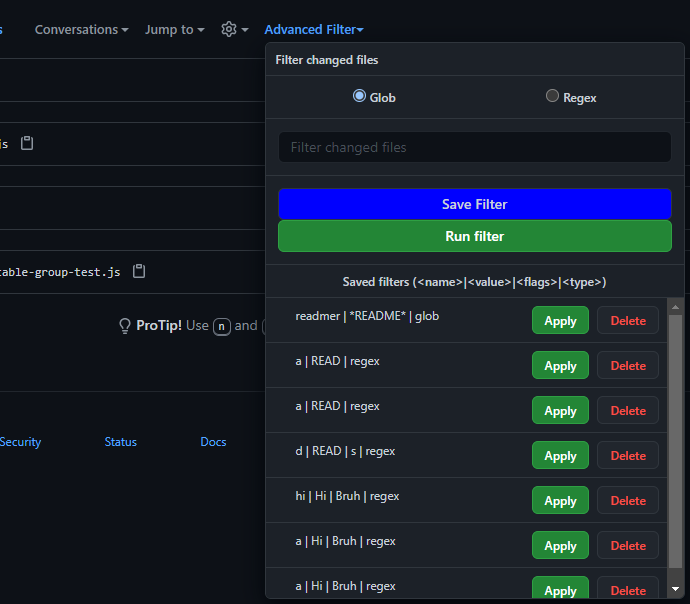

# github-pr-filter

A google chrome extension that given a glob pattern string, filters your github pull request's changed files by collapsing them.

## Usage
[Chrome Extension](https://chrome.google.com/webstore/detail/github-pr-filter/pphamkmhoolkjbakfllocenmbdbdnakl)

## Features

1. Glob search
2. Regex search
3. Saving a filter
4. Applying a filter
5. Deleting a filter

## Prerequisite
1. [minimatch](https://github.com/isaacs/minimatch)
2. [browserify](https://github.com/browserify/browserify)

## Develop
1. Run `browserify assets/filterGlob.js --s filterGlob > filterGlob-bundle.js`.
2. [Load the unpacked extension](https://developer.chrome.com/docs/extensions/mv3/getstarted/#manifest)
3. Go to any pull request's changed files page and you should see the widget

## Implementation

### Glob Filter Widget
We search for the github toolbar with all the widgets and append our widget in there. From there, you can enter a glob pattern string and when you press `Run filter`, we'll collapse any opened files that **does not** matches the glob pattern.

### Glob pattern matching
This extension uses [minimatch](https://github.com/isaacs/minimatch) to perform the glob matching. Because `minimatch` is a node package and uses `cjs`. We need to use a bundler to generate an `esm`, since browsers can only use `esm`.
So I chose [browserify](https://github.com/browserify/browserify).

### Regex pattern matching
This extension uses the native Javascript `RegExp` to perform regular expression searches.

## Contribute
Any contribution is welcomed! Please take a look at the issues or look for `TODO` comments.